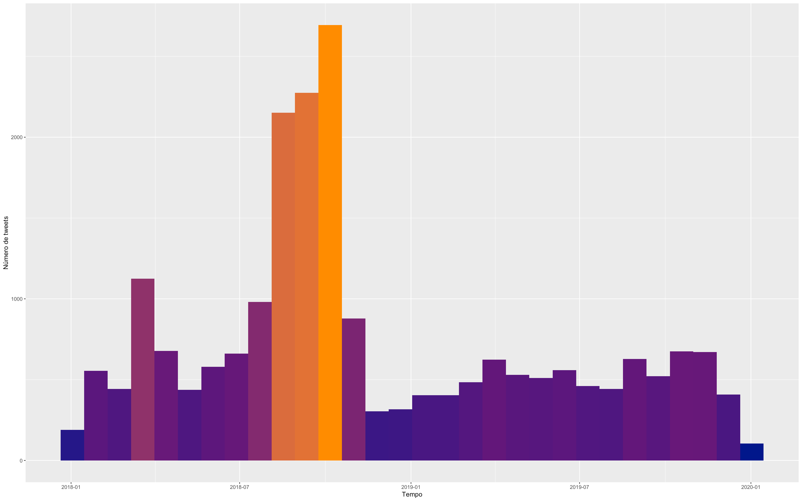
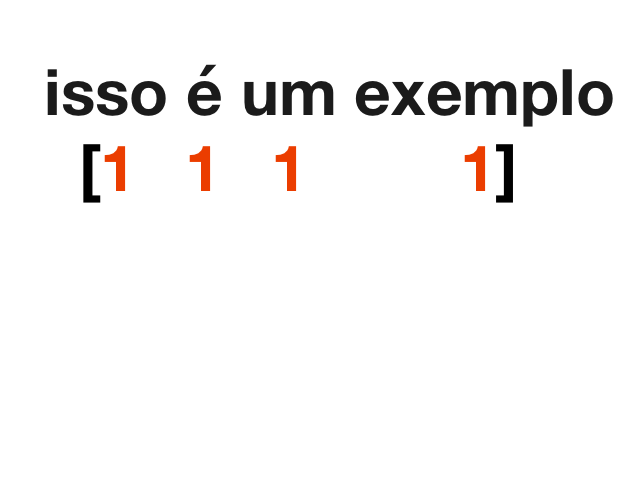
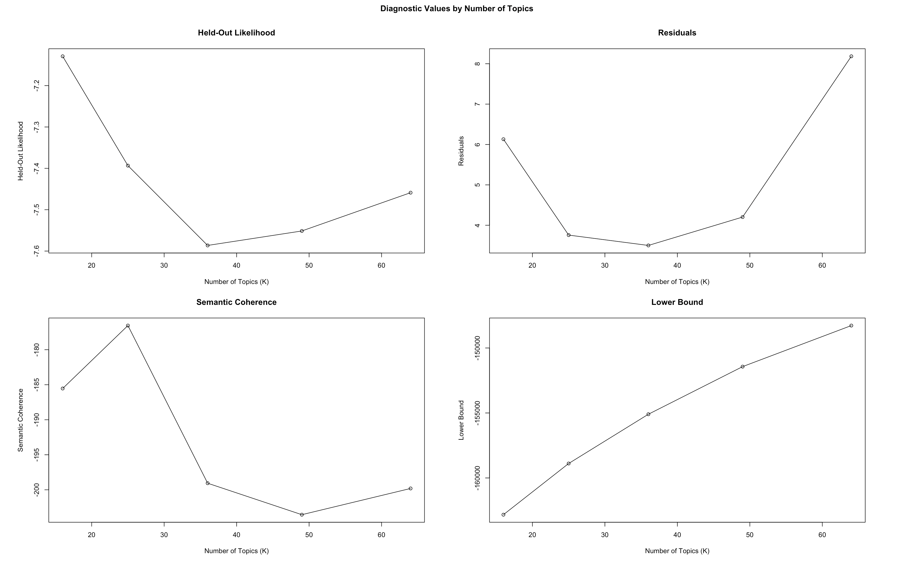
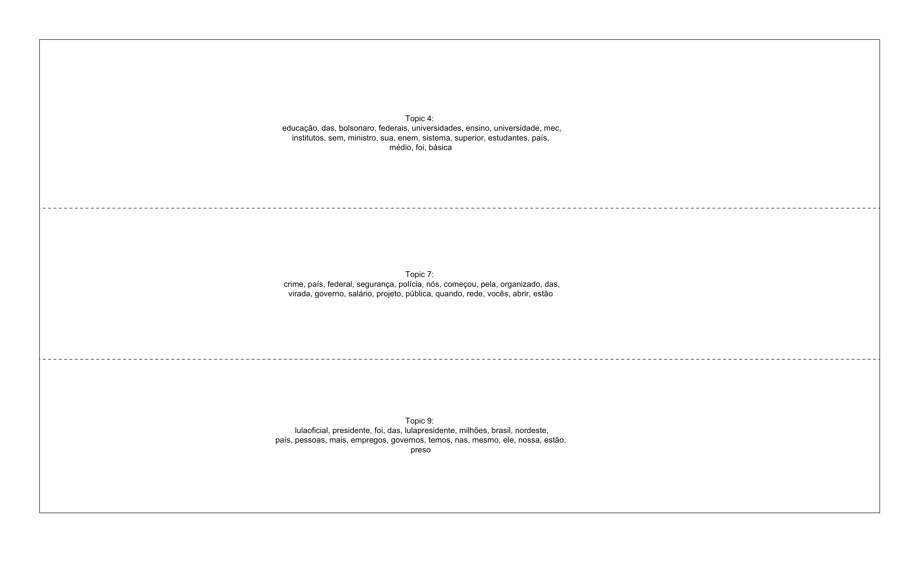
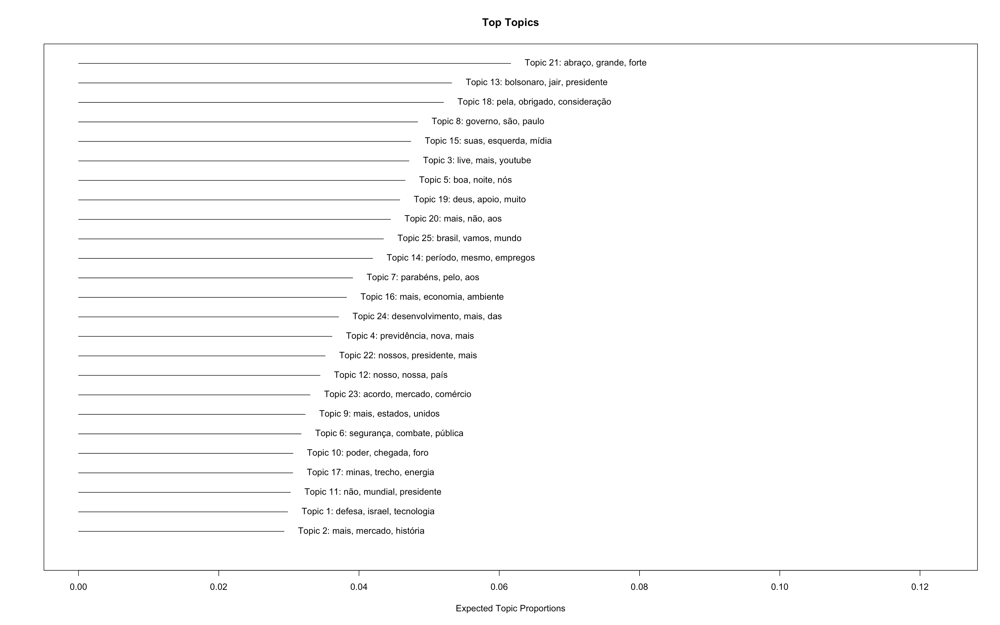
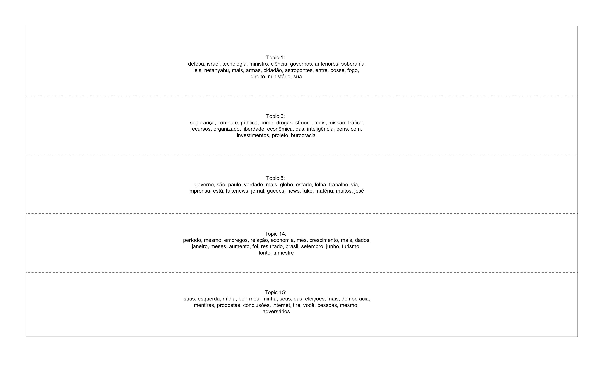
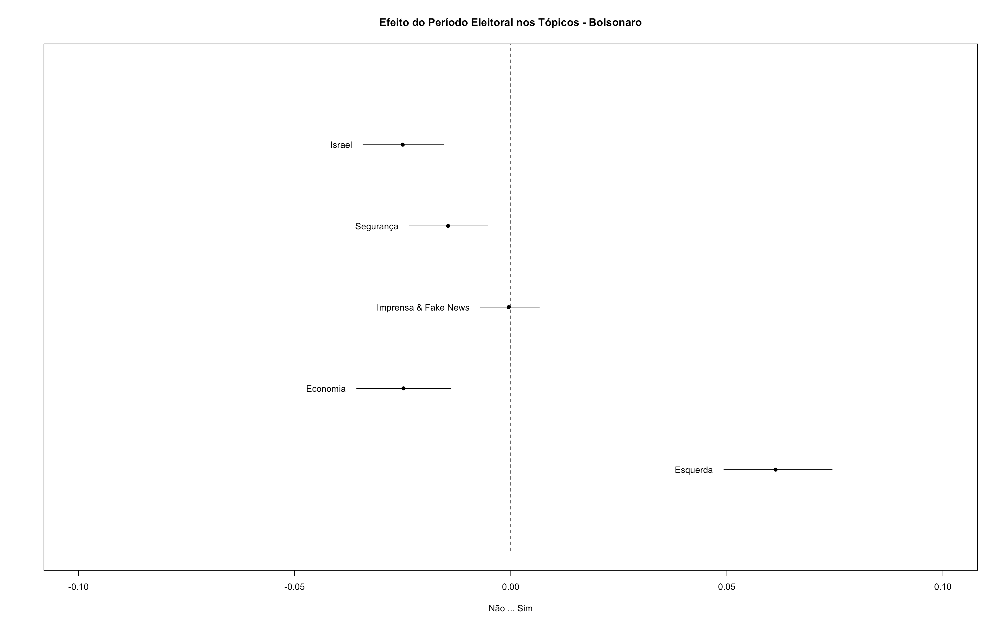

```{r setup, include=FALSE}
knitr::opts_chunk$set(echo = TRUE, eval = FALSE, message = FALSE, warning = FALSE)
```


## 1. Resumo

O movimento de incorporação das redes sociais no processo eleitoral e suas constantes inovações no Brasil e no mundo, suscitam grandes expectativas, algumas delas relacionadas a compreensões normativas de democratização. Poderíamos citar desde especulações sobre a redução de desigualdades de acesso a recursos competitivos entre candidatos, até pressuposições sobre a adoção de uma comunicação mais responsiva e deliberativa entre elites políticas e eleitores. Neste texto, contudo, nos inspiramos na compreensão desenvolvida em trabalhos empíricos no campo da comunicação e política [@BragaCarlomagno2018], que asseveram que, mais do que suposições e uma discussão sobre os potenciais das ferramentas digitais, é necessário observar os usos que os atores verdadeiramente fazem delas. Nesse sentido, buscaremos aqui promover essa perspectiva, discutindo brevemente algumas pesquisas sobre o contexto brasileiro e apresentando um tutorial com uma alternativa de como realizar pesquisas com bases textuais de redes sociais, utilizando modelagem de tópicos (Topic Modeling). No exercício aplicado, procuramos estimar, por meio de dados do Twitter, como o período eleitoral pode ter afetado os tópicos tratados pelos candidatos à presidência nas eleições de 2018.

## 2. Mídias digitais e política: um campo de estudos em ascensão

Passadas as eleições de 2018, talvez não restem dúvidas de que as mídias sociais constituem um componente e fator político muito importante, e devem especialmente ser levadas em conta para a compreensão das eleições no Brasil e no mundo. Considerando que este campo, do uso político das ferramentas digitais, é intrinsecamente dinâmico, buscamos nesta seção exemplificar algumas questões relevantes e discutir sobre a forma como as próprias mídias digitais foram e podem ser utilizadas pelos pesquisadores para abordá-las. Não temos a pretensão aqui de discutir todo o percurso de incorporação das mídias nas campanhas políticas, ou fazer uma revisão bibliográfica sobre o campo^[Ver @BragaCarlomagno2018]. O propósito aqui é o de chamar atenção a algumas questões relevantes e incentivar a pesquisa empírica nessa área de estudos. 

Como ponto de partida, podemos tratar do contexto teórico em que se insere essa discussão. O que recorrentemente se ressalta sobre as mídias digitais e as redes sociais virtuais é o seu caráter “desintermediado” [@Aggio2020]. Afirma-se, grosso modo, que estamos em uma nova era, distante dos antigos “filtros” dos meios de comunicação tradicionais e com possibilidades de interatividade imensas. A grande quantidade de usuários – eleitores – em conjunto, expostos continuamente a informações, vinculados por redes com ferramentas à disposição para interação, é obviamente um terreno fértil e igualmente estratégico para a política. Como resultado, é valido questionar se as práticas tradicionais de campanha, baseadas nos meios antigos, foram solapados ou se o meio digital é agora o centro da disputa pelos votos. Utilizaremos os textos de Marques, Silva e Matos [-@MarquesSilvaMatos2011] e Aggio e Reis [-@AggioReis2013] para iniciar a discussão, e incorporaremos também as contribuições desenvolvidas por Braga e Carlomagno [-@BragaCarlomagno2018], Aggio [-@Aggio2020] e Murta, Magalhães e Pimentel [-@MurtaMagalhaesPimentel2019].

A primeira questão é mais diretamente abordada por Marques, Silva e Matos [-@MarquesSilvaMatos2011]. Os autores procuram avaliar a estratégia de campanha de José Serra no Twitter, explorando as mudanças na frequência e nos conteúdos das postagens durante o período eleitoral de 2010. Como resultado, consideram que, ainda que Serra seja um usuário assíduo e tenha tido, possivelmente, mais razões para utilizar a ferramenta de maneira a se mostrar mais acessível, sua campanha e métodos de abordagens dos eleitores foram basicamente tradicionais. Ou seja, possuíam os mesmos princípios de divulgação e persuasão “de cima para baixo”, e não buscavam uma relação dialógica, especialmente sobre propostas políticas, com os seus seguidores. Aggio e Reis [-@AggioReis2013] adotam uma estratégia de pesquisa semelhante, mas se aproximam mais da segunda questão que apontamos anteriormente, sobre a centralidade do contexto das ferramentas digitais, nesse caso, o Facebook, para as campanhas vencedoras de 3 candidatos a prefeito de capitais brasileiras no ano de 2012.

Os autores (*ibid.*), nesse sentido, procuram relacionar o efeito da interação entre os candidatos e os usuários, com o sucesso eleitoral. Mais especificamente, eles observam um aumento quantitativo de interações às postagens dos candidatos e se atentam ao uso que os mesmos fizeram das “gramáticas preexistentes” da rede, como o compartilhamento de memes, fotos e vídeos. Com isso, poderíamos reformular a questão anteriormente apresentada da seguinte maneira: quem melhor incorpora as lógicas das ferramentas, tem maiores chances de vencer? Isso não parece muito plausível, ou ao menos não ainda. Braga e Carlomagno [-@BragaCarlomagno2018] realizam uma pesquisa de maior folego sobre a incorporação e influência das mídias digitais nas campanhas políticas no Brasil até 2016, com ênfase nas disputas pelos cargos majoritários. Os autores conseguem observar algumas tendências, contudo, o grau de interação (curtidas, seguidores, compartilhamento, etc.) não é crescentemente e homogeneamente correlacionado, entre diferentes categorias de candidatos, com o sucesso eleitoral. Mas as eleições presidenciais apresentam resultados mais animadores do que estaduais e municipais. 

O ponto principal, contudo, é que eles apontam que já em 2016 praticamente toda a classe política utilizava redes sociais. Nesse ponto, as desigualdades regionais não mais se verificariam e poderíamos considerar que todo os candidatos teriam um patamar mínimo de acesso a esses meios e recurso de competição. Mas assim como existem muitas outras “fontes” de desigualdades nos processos de competição política, acumulam-se também casos de candidatos destacados nas redes sociais com um correspondente resultado eleitoral muito baixo (*ibid.*). Isso nos faz duvidar de que o meio digital é o centro de disputa pelos votos.

Em contrapartida, as eleições nacionais de 2018 poderiam fornecer evidência contrária a esse argumento. O então candidato Jair Bolsonaro notoriamente não estava em vantagem nos meios de campanha tradicionais, como o Horário Político Eleitoral Gratuito. Nesse sentido, Aggio [-@Aggio2020] procura avaliar se a campanha de Bolsonaro no Twitter lançou mão de mecanismos de interação direta com os usuários, dado que o próprio presidente enaltecia e enaltece as redes sociais virtuais como uma maneira de comunicação desintermediada com “o povo”. É importante destacar que a ideia de “interação” tem aqui um sentido diferente do que foi abordado até então nos textos de Aggio e Reis [-@AggioReis2013] e Braga e Carlomano [-@BragaCarlomagno2018]. Os dois últimos mediram, nos referidos períodos eleitorais, o que pode ser entendido como a audiência que os candidatos obtiveram, e não o diálogo e a interação entre estes e os usuários. Marques, Silva e Matos [-@MarquesSilvaMatos2011], por meio de análise de conteúdo das postagens, examinam se a campanha de Serra se adaptou à lógica interativa da ferramenta, no mesmo sentido que Aggio [-@Aggio2020] veio a adotar posteriormente. 

A inovação do texto de Aggio [-@Aggio2020] foi interpretar e classificar as estratégias de comunicação eleitoral de Bolsonaro adotando como cerne de sua análise os diferentes graus de interação possibilitados pela própria ferramenta. Os mecanismos do Twitter para a comunicação horizontal são as menções e os retweets, e o candidato pode se utilizar delas de maneira direta, substantivamente desenvolvendo um “bate papo” com os usuários acionados, ou de forma indireta, utilizando como mera reiteração e/ou exemplificação do conteúdo compartilhado. Desse modo, pode-se compreender quais as formas de atividade foram majoritárias, mas também explorar suas associações a determinados atores, públicos e conteúdos estratégicos. Surpreendentemente, o uso dos recursos de interação e deliberação também não foram a prioridade desta campanha. 

A maioria das atividades de Bolsonaro foram de tweets originais, voltados para a propaganda e o ataque e exposição dos adversários políticos. A minoria de atividades interativas estava associada a reverberação de mensagens de apoio, com extensivo uso de vídeos e artifícios imagéticos, e raríssima atenção a discussão de propostas políticas. Nesse sentido, observamos que as práticas tradicionais, mesmo nesse caso atípico, não foram solapadas, apesar da simultânea e inegável centralidade adquirida pelas redes sociais da internet. 

A pesquisa desenvolvida por Murta, Magalhães e Pimentel [-@MurtaMagalhaesPimentel2019] apresenta  outra dimensão desta centralidade e traz para o Brasil estudos mais disseminados nos EUA, que procuram entender a correlação entre interações e sucesso eleitoral, como um novo formato de pesquisa com grande potencial para substituir as sondagens de voto. A ideia dos autores é a de que a adesão às redes sociais virtuais é hoje no Brasil tão generalizada e extensiva, que é possível construir indicadores confiáveis por meio dos dados digitais. 

De tudo isso, retiramos que há uma óbvia convergência de atração aos candidatos pelo imenso trânsito de pessoas que se expressam e interagem politicamente e visivelmente nas mídias digitais. No entanto, alternativamente, não consideramos muito útil pressupor ou derivar dos potenciais interativos e democráticos das redes uma completa e automática transformação da política, como ilustramos no início do texto. Seria, como supor que a política se apropriará completamente desse meio porque ele é “obviamente” melhor. Ou que o meio invariavelmente irá impor uma adequação total aos políticos. Inspirados por estes trabalhos e através deles, pudemos entender que esse campo é intrinsecamente dinâmico e que há muitos ganhos quando nos aprofundamos na própria ferramenta através dos casos empíricos.
  
Partindo do estudo de Aggio [-@Aggio2020] sobre Bolsonaro, por exemplo, podemos ainda enxergar de maneira mais clara que há, na incorporação das lógicas das redes sociais por parte do candidatos, ao menos duas variantes. Uma, que o autor já havia explorado no estudo de 2013 com Reis, sobre o uso das linguagens “preexistentes” com a finalidade de mobilizar uma eventual militância; a outra, que pode simular um comportamento interativo e acessível do candidato, semelhante ao dos demais usuários. Este último pode estar vinculado a estratégias populistas, como no caso de Bolsonaro, ou a uma compreensão participacionista. Ainda não temos respostas, não sabemos exatamente como associar essa adequação ao sucesso, e as “curtidas” também não constituem um *proxy* certeiro. Há muito a ser explorado.
  
Uma perspectiva interessante, adotada por Marques, Silva e Matos [-@MarquesSilvaMatos2011] e Aggio e Reis [-@AggioReis2013], é a de observar a mudança no comportamento dos candidatos, nos assuntos abordados e frequência de uso das mídias, em função do período eleitoral. Com base nisso, na próxima seção apresentaremos um tutorial com uma ideia semelhante, explorando os tweets dos principais candidatos à presidência no pleito de 2018. Explicaremos como fazer um gráfico de frequência e como explorar o conteúdo de tweets através da técnica de modelagem de tópicos (Topic Modeling), para em seguida, observar o efeito do período eleitoral sobre a frequência de uso e os principais assuntos abordados por cada candidato. Nesse sentido, à diferença dos autores tratados aqui, não examinaremos as publicações dos candidatos através de análise de conteúdo.
  
Cumpre observar que tanto Marques, Silva e Matos [-@MarquesSilvaMatos2011] quanto Aggio e Reis [-@AggioReis2013] ressaltam o fato de que alguns candidatos de suas observações haviam acabado de ingressar nas redes sociais virtuais ou tinham um perfil praticamente inativo antes do pleito. Talvez por isso a diferença de frequência no uso das ferramentas tenha sido ainda mais importante para essas análises. Por sua vez, tanto os resultados de José Serra [@MarquesSilvaMatos2011], quanto de Jair Bolsonaro [@Aggio2020] foram de campanhas que priorizaram estratégias “top down” e igualmente não discutiam sobre políticas substantivas. É possível supor que, passado o tempo, tenham havido maiores mudanças, e outras campanhas procurem discutir sobre propostas de políticas substantiva? Ou, é possível que campanhas procurem abordar não propostas, mas temas políticos, como uma ferramenta de mobilização adequada a essas redes? A nossa suposição, que não teremos oportunidade de desenvolver aqui, é a de que os comportamentos exibidos pelos candidatos nos últimos anos, possam astar sendo mais homogênos no tempo. Ou seja, eles não destoariam tanto do periodo eleitoral em relação a datas mais distantes do pleito, em função da própria centralidade adquirida da presença online desses atores, condicionando comportamentos de campanha mais distendidos.  

não destoem tanto no periodo elitoral do que era observado em datas mais distantes do pleito. Em razão do maior peso das redes de maneira geral, sopomos que pode estar havendo uma distensão dos período de campanha. solidificação da imagem

## 3. Como realizar pesquisas utilizando modelagem de tópicos

Apresentaremos agora um tutorial de como fazer análise de texto e modelagem de tópicos (*topic modeling*), usando R e Python, e extrair informações valiosas dos principais assuntos tratados por atores políticos no Twitter. Consideramos que esse modelo de mineração de texto pode ser uma boa alternativa para a realização de pesquisas com dados textuais coletados de redes sociais. Com essa técnica, é possível lidar com toda a complexidade desse tipo de dado, organizando e simplificando as informações ao separá-las por tópicos. 

A Modelagem de Tópicos é utilizada para se ter uma ideia inicial do que os dados estão tratando, sem a necessidade de uma leitura prévia [@staudt2016]. Consiste em um método para classificação não supervisionada, que encontra grupos naturais de palavras, mesmo quando não temos certeza do que estamos procurando [@silge2017]. É uma ferramenta útil para exploração de dados, nos quais os tópicos proveem um resumo dos dados textuais, algo que seria impossível de se obter manualmente [@schneider2014]. 

No nosso exercício, aplicamos esse modelo para observar o comportamento no Twitter dos principais candidatos à presidência das eleições de 2018, especificamente o efeito do período eleitoral sob a quantidade de postagens e os principais tópicos abordados por eles. Com essa análise, objetivamos responder as seguintes questões:

I.	Como o período eleitoral impactou o comportamento dos candidatos à presidência no twitter? 

II.	Há mudanças significativas na frequência de uso e no que é abordado pelos candidatos em relação a datas mais distantes do pleito?

A proposta apresentada neste tutorial é meramente ilustrativa e exploratória. O principal intuito é o de incentivar e instrumentalizar futuras análises. Vamos observar a mudança de frequência de postagens no Twitter pelos principais candidatos à presidência nas eleições de 2018 - Ciro Gomes, Fernando Haddad, Geraldo Alckmin, Guilherme Boulos, Jair Bolsonaro, Luiz Inácio Lula da Silva e Marina Silva - e, em seguida, analisar quais foram os principais tópicos tratados pelos dois candidatos concorrentes no segundo turno desse pleito - Fernando Haddad e Jair Bolsonaro -, bem como examinar as mudanças destes tópicos em função do período eleitoral.

Para facilitar a compreensão do método aplicado, dividimos o processo de análise dos dados em 5 fases, que estão expostas nas próximas subseções. 

###	3.1. Coleta dos dados

Começaremos obtendo os dados brutos que possibilitarão a nossa análise. A tarefa é relativamente simples, visto que há diversos pacotes disponíveis para coleta de dados do Twitter, inclusive uma API da própria plataforma. Nesse exercício, faremos uso do pacote getoldtweets3, que permite recuperar tweets antigos, para extrairmos dados de sete presidenciáveis das eleições de 2018: Ciro Gomes, Geraldo Alckmin, Fernando Haddad, Luís Inácio Lula da Silva, Jair Bolsonaro, Guilherme Boulos e Marina Silva. 

```{r}

import GetOldTweets3 as got
import pandas as pd

usernames = ['cirogomes', 'geraldoalckmin', 'GuilhermeBoulos', 'Haddad_Fernando',
 'jairbolsonaro', 'LulaOficial', 'MarinaSilva']

def download_tweets(username):
    print(f"Downloading for {username}")
    tweetCriteria = got.manager.TweetCriteria().setUsername(username)\
                                               .setSince("2018-01-01")\
                                               .setUntil("2020-01-01")\

    tweets = got.manager.TweetManager.getTweets(tweetCriteria)
    df = pd.DataFrame([tweet.__dict__ for tweet in tweets])
    print(df.shape)
    df.to_csv(f"{username}.csv", index=False)


for username in usernames:
    download_tweets(username)

```

Selecionamos apenas o conteúdo postado no intervalo entre 01/01/2018 e 01/01/2020, de modo a cobrirmos o período eleitoral e o ano subsequente, e armazenamos os resultados como uma planilha CSV. 
Obtidas as planilhas, formamos uma única base de dados, juntando-as com a linguagem de programação R. Fazendo uso das datas dos tweets, criamos então uma variável binária sinalizando se o tweet foi ou não compartilhado durante o período eleitoral, de 07/07/2018 a 29/10/2018.

```{r}
# chamando os pacotes
require(tidyverse)
library(readr)

`%notin%` <- Negate(`%in%`)

# lendo as bases de dados
Bolsonaro <- read_csv("jairbolsonaro.csv")
Marina <- read_csv("MarinaSilva.csv")
Alckmin <- read_csv("geraldoalckmin.csv")
Haddad <- read_csv("Haddad_Fernando.csv")
Lula <- read_csv("LulaOficial.csv")
Boulos <- read_csv("GuilhermeBoulos.csv")
Ciro <- read_csv("cirogomes.csv")

# unindo as bases em um único data frame e criando a variável "person"
combinado <- bind_rows(
  Bolsonaro %>%
    mutate(person = "Bolsonaro"),
  Marina %>%
    mutate(person = "Marina"),
  Alckmin %>%
    mutate(person = "Alckmin"),
  Boulos %>%
    mutate(person = "Boulos"),
  Haddad %>%
    mutate(person = "Haddad"),
  Lula %>%
    mutate(person = "Lula"),
  Ciro %>%
    mutate(person = "Ciro"),
) 

# criando variável binária sinalizando compartilhamento no período eleitoral
combinado <- combinado %>% 
  mutate(periodo_eleitoral = case_when(
    (combinado$date < as.Date('2018-10-29'))&(combinado$date > as.Date('2018-07-07')) ~ "Sim",
                                                                         T ~ "Não"))

# salvando o data frame como arquivo CSV
write.csv(combinado, 'tweets_presidenciaveis.csv', row.names = F)

```

Formada a base de dados, podemos visualizar facilmente como os tweets se distribuíram ao longo do tempo. É possível observar na figura abaixo que o período eleitoral, em laranja, foi o período de maior atividade do candidatos no Twitter^[Como a modelagem é computacionalmente intensiva, podendo demorar vários minutos, optamos por carregar as imagens diretamente, mas todos os códigos que as geraram são mostrados aqui.]:

```{r}
ggplot(data = combinado, aes(x = date)) +
  geom_histogram(aes(fill = ..count..)) +
  theme(legend.position = "none") +
  xlab("Tempo") + ylab("Número de tweets") + 
  scale_fill_gradient(low = "darkblue", high = "darkorange")
```



### 3.2.	Vetorização 

Após a coleta dos dados brutos, deixamos o conjunto de dados em um formato para que pudesse ser processado no R. Dessa forma, vetorizamos o corpus por meio de um processo chamado de tokenização, que consiste em converter as sentenças de texto em vetores numéricos. Para isso, utilizamos a técnica de saco de palavras (*bag of words*), uma representação simplificada dos dados textuais, que faz um processo de contagem, mas qualquer informação sobre a gramática ou a posição das palavras é descartada. O saco de palavras é transformado em um conjunto de termos e suas respectivas frequências^[https://minerandodados.com.br/como-preparar-dados-de-texto-para-machine-learning/ Acesso em 16/12/2020.] . Dessa forma, a frase “isso é um exemplo” seria um vetor linha com quatro colunas, com o valor 1 para cada palavra. Confira-se a seguinte figura:



### 3.3.	Tratamento dos dados 
Após a vetorização dos dados coletados do Twitter, foi realizada uma limpeza deles, removendo os dados desnecessários do corpus, como palavras impedidas (*stopwords*) [@silge2017]. Essas palavras são aquelas muito frequentes no texto, mas que geram poluição na base de dados. Essas palavras são removidas para manter as distintivas, que ajudarão na composição dos tópicos do nosso exercício.

### 3.4	Cálculo da matriz de frequência dos documentos 
Após o pré-processamento dos dados, uma matriz de associação é criada para a identificação de frequência dos termos e associação entre eles. O conjunto de textos é transformado em uma matriz de termos, contendo as palavras em cada linha e os documentos (cada tweet) em cada coluna. O conteúdo da célula é a frequência do termo em cada documento. O interessante nisso é descobrir quais palavras têm alta probabilidade de aparecerem juntas, ou seja, quais palavras têm maior probabilidade de aparecer em cada tópico. No pacote stm, a vetorização, a remoção de *stop words* e o cáluclo da matriz de frequência dos documentos ocorrem no mesmo passo, por meio da função processed. Neste exercício, utilizaremos os tweet do candidato Fernando Haddad:

```{r}
tweets <- readtext("tweets_presidenciaveis.csv")
tweets <- tweets %>% filter(person == "Haddad")
tweets <- tweets %>% rename(documents = text.1)
processed <- textProcessor(tweets$documents, stem= F, lowercase = F, 
                           metadata = tweets, removestopwords = T, 
                           customstopwords = stop, striphtml = T)
```

### 3.5. Aplicação da modelagem STM (Structural Topic Model) 
A última fase da análise de texto empreendida foi a utilização de uma modelagem probabilística de tópicos: o modelo de tópico estrutural (STM). A modelagem de tópicos trata cada documento como uma mistura de tópicos e cada tópico como uma mistura de palavras. Um tópico é definido como uma distribuição de probabilidade sobre um vocabulário fixo. Como exemplo, um tópico sobre “economia” será aquele que contém palavras relacionadas à “economia” com maior probabilidade de ocorrência. Por outro lado, um tópico que se relacione com qualquer outro assunto distinto conterá palavras sobre economia com probabilidade de ocorrência muito baixa ou zero. Todos os tópicos contêm distribuições com probabilidades sobre todo o vocabulário fixo, mas essas probabilidades só assumirão valores mais altos nos termos que caracterizam o tópico [@schneider2014]. 

O STM consiste em um modelo gerador de contagens de palavras, semelhante ao modelo de tópico de alocação latente de Dirichlet (LDA), que permite aos pesquisadores descobrir tópicos e estimar sua relação com os metadados do documento [@stm]. Esse modelo é adequado para nossos propósitos porque nos permite não apenas descobrir os tópicos latentes no corpus, mas também estimar o efeito da covariável “período eleitoral” em sua distribuição, como fizemos para testar como o período eleitoral afetou esses tópicos durante as eleições de 2018. O pacote stm exige que o vocabulário, os metadados e os documentos sejam armazenados em três variáveis distintas:

```{r}
out <- prepDocuments(processed$documents, processed$vocab, processed$meta)
docs <- out$documents
vocab <- out$vocab
meta <-out$meta
```

Terminadas essas etapas preliminares, a primeira tarefa é determinar o número de tópicos. Essa escolha é em parte subjetiva, devido à complexidade inerente à linguagem, mas pode ser feita de várias formas. Um critério possível é simplesmente examinar a qualidade dos tópicos, isto é, o quão bem eles refletem os temas que devem representar [@quinn]. Também podemos examinar estatísticas para diferentes números de tópicos. Neste artigo, combinamos as duas abordagens, calculando diversas estatísticas para 16, 25, 36, 49 e 64 tópicos com os tweets de Fernando Haddad por meio da função searchk. Confira-se o código e a figura abaixo:

```{r}
findingk <- searchK(out$documents, out$vocab, K = c(16, 25, 36, 49, 64),
                    prevalence =~ periodo_eleitoral, data = meta, verbose=FALSE)
plot(findingk)
```



Cumpre frisar que é preciso cautela no uso e interpretação dos resultados obtidos com a modelagem de tópicos. Os tópicos e sua distribuição ao longo dos documentos obtidos não são “definitivos”. O ajuste de um modelo de tópicos a uma coleção sempre irá produzir padrões a partir do corpus, ainda que os mesmos não estejam “naturalmente” presentes na coleção [@schneider2014].

Baseado nesses resultados, optamos por realizar a modelagem com k=25 tópicos, o valor com maior coerência semântica.

```{r}
F_STM <- stm(documents = out$documents, vocab = out$vocab,
             K = 25, prevalence =~ periodo_eleitoral,
             max.em.its = 250, data = out$meta,
             init.type = "Spectral", verbose = T,
             seed = pi)
plot(F_STM)

```


Examinando o resultado de nossa modelagem, podemos observar vários tópicos de interesse político. Em especial, os tópicos 4, 7 e 9 parecem se referir à educação, segurança e ao ex-presidente Lula, respectivamente. Usando o argumento type="labels" na função plot, podemos examinar esses tópicos em maior detalhe:

```{r}
plot(F_STM, type="labels", topics=c(4, 7,9))
```



Um exame das 20 palavras mais frequentes em cada tópico confirma nossa observação de que eles se estruturam em torno de eixos temáticos distintos. Podemos agora calcular como o período eleitoral impactou a frequências desses tópicos:

```{r}
predict_topics<-estimateEffect(formula = 1:25 ~ periodo_eleitoral, stmobj = F_STM, 
                                                             metadata = out$meta, uncertainty = "Global")
plot(predict_topics, covariate = "periodo_eleitoral", topics = c(4, 7, 9),
     model = F_STM, method = "difference",
     cov.value1 = "Sim", cov.value2 = "Não",
     xlab = "Não ... Sim",
     main = "Efeito do Período Eleitoral nos Tópicos - Haddad",
     xlim = c(-.1, .1),
     labeltype = "custom",
     custom.labels = c('Educação', "Segurança", 'Lula'))

```


Podemos observar que o tópico do ex-presidente Lula foi particularmente saliente durante o período eleitoral, enquanto tweets sobre política educacional ocorreram mais frequentemente fora do período eleitoral.

O mesmo exercício pode ser realizado com os tweets do então candidato Jair Bolsonaro:

```{r}
tweets <- readtext("tweets_presidenciaveis.csv")
tweets <- tweets %>% filter(person == "Bolsonaro")
tweets <- tweets %>% rename(documents = text.1)
processed <- textProcessor(tweets$documents, stem= F, lowercase = F, 
                           metadata = tweets, removestopwords = T, 
                           customstopwords = stop, striphtml = T)
out <- prepDocuments(processed$documents, processed$vocab, processed$meta)
docs <- out$documents
vocab <- out$vocab
meta <-out$meta

```

Isolamos os tweets postados pelo candidato, vetorizamos seu conteúdo, removemos stopwords e finalmente calculamos a matriz frequência de documentos, armazenando o vocabulário, os metadados e os documentos em três variáveis separadas. Podemos então fazer outro modelo de tópico estrutural:

```{r}
F_STM <- stm(documents = out$documents, vocab = out$vocab,
             K = 25, prevalence =~ periodo_eleitoral,
             max.em.its = 250, data = out$meta,
             init.type = "Spectral", verbose = T,
             seed = pi)
plot(F_STM)

```



Pinçamos os tópicos mais politicamente salientes para uma análise mais cuidadosa de seu conteúdo:

```{r}
plot(F_STM, type="labels", topics= c(1, 6, 8, 14, 15))
```



Podemos então classifica-los em temas e estimar o efeito do período eleitoral em sua distribuição:

```{r}
predict_topics<-estimateEffect(formula = 1:25 ~ periodo_eleitoral, stmobj = F_STM, 
                               metadata = out$meta, uncertainty = "Global")
plot(predict_topics, covariate = "periodo_eleitoral", topics = c(1, 6, 8, 14, 15),
     model = F_STM, method = "difference",
     cov.value1 = "Sim", cov.value2 = "Não",
     xlab = "Não ... Sim",
     main = "Efeito do Período Eleitoral nos Tópicos - Bolsonaro",
     xlim = c(-.1, .1),
     labeltype = "custom",
     custom.labels = c("Israel", "Segurança", 'Imprensa & Fake News', "Economia", "Esquerda"))

```



Vemos então que o presidente Jair Bolsonaro fez mais comentários sobre seus adversários políticos na esquerda durante o período eleitoral. Comentários críticos à imprensa, por outro lado, ocorreram de forma homogênea dentro e fora do período eleitoral.  

## 4. nsiderações Finais 

 Este trabalho buscou explorar novas possibilidades analíticas para o estudo de eleições e mídias digitais a fim de contribuir para o avanço dessa importante agenda de pesquisa. As redes sociais estão sendo cada vez mais utilizadas em campanhas eleitorais, sendo o twitter uma ferramenta relevante de interação e comunicação dos candidatos com eleitores. As mensagens divulgadas nessa rede podem ganhar grande dimensão e influenciar, de certa forma, o debate político. Sendo assim, uma abordagem como a que apresentamos, que contempla os principais tópicos debatidos pelos candidatos e compara a frequência dos temas em períodos eleitorais e não-eleitorais, pode ser muito útil para compreender como o período eleitoral pode afetar as discussões políticas empreendidas e comparar os assuntos mais explorados pelos diferentes candidatos. 
  Para obter informações sobre o que os candidatos publicaram, utilizamos a ferramenta modelagem de tópicos (Topic Modeling). Uma limitação que podemos apontar dessa alternativa em relação as análises de conteúdo que foram empreendidas em alguns dos textos que discutimos aqui, é que não pudemos avançar em uma compreensão do uso estratégico da ferramenta por parte dos candidatos. Ou seja, não temos como aferir, por exemplo, se os tópicos abordados estariam associados a discussões substantiva de políticas públicas, se haveria uma disposição interativa por parte dos candidatos ou mesmo se temas são utilizados estrategicamente, como uma forma de mobilização adequada a esses contextos. 
Uma outra limitação, está em torno da validação das categorias estabelecidas. Nesse sentido, recomendamos que análises futuras procurem também um maior aprofundamento metodológico nestes processos de verificação. Em nosso caso, o fizemos de maneira subjetiva, adequando a quantidade de tópicos de acordo com o que parecia ter uma associação consistente e significativa. Uma alternativa interessante é encontrada em Quinn (2010), onde o autor procura associar a distribuição dos tópicos ao longo do tempo com eventos externos.
  Em termos de análise, pudemos verificar, mesmo que de maneira ainda muito inicial, dado os fins desse texto, que o fato de estar em campanha, aumenta consideravelmente o uso das redes entre os candidatos. Isso parece ir contra a suposição que fizemos ao final da primeira seção desse texto, de que seria possível que estivesse havendo a conformação de uma nova tendência no uso dessas ferramentas por parte dos candidatos. Consideramos que mais análises precisam ser feitas, em especial, comparando de maneira mais detida as diferenças de uso em diferentes períodos. A respeito dos principais temas tratados, vale destacar, que a avaliação do uso predominante de críticas aos adversários feita pela campanha de Jair Bolsonaro no twitter, coincide com os resultados de Aggio (2019) sobre o mesmo período, a partir de uma análise qualitativa.  
  Deste modo, consideramos que apesar de algumas limitações, a técnica da modelação de tópicos abre muitas possibilidades nesse campo. Associada a outros instrumentais analíticos, poderíamos obter diversas contribuições sobre como diferentes atores mobilizam temas e ideias nas redes sociais e como debate público é travado nestas esferas. Todavia, salientamos, por fim, que as conclusões retiradas de pesquisas com base apenas em dados da redes sociais retratam apenas uma dimensão da realidade, uma vez que a comunicação via twitter é direcionada a um público específico, usuário dessa rede. Além disso, muitas das conclusões são parciais e devemos ter atenção em como o discurso online dos candidatos corresponde a suas ações políticas. 
 
## 5. Referências bibliográficas
